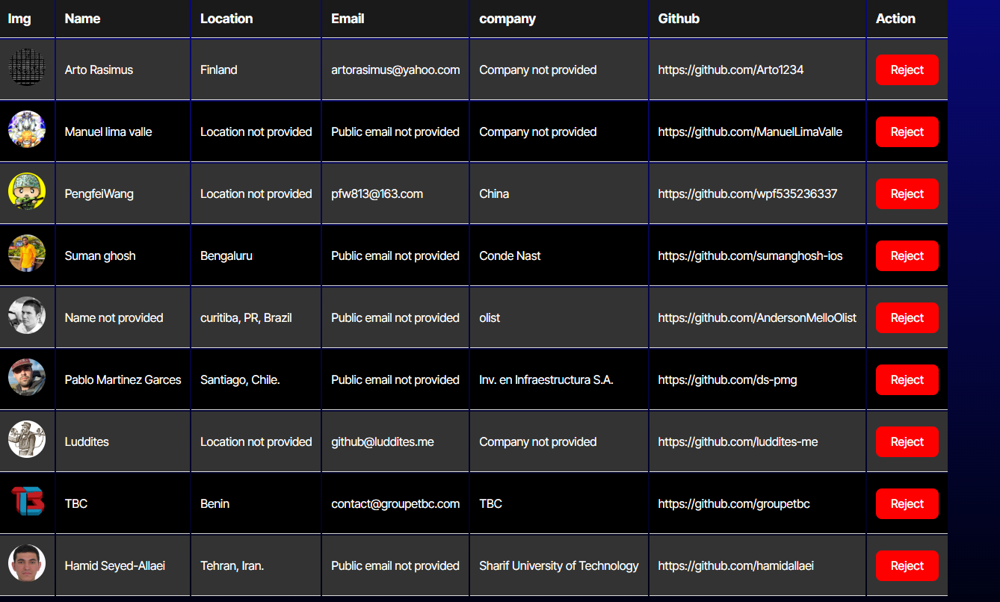

# Candidate Search 

## Description
This application allows you to cylce through validated git hub users! You can store users to local storage and determine if you want to hire them. if you don simply click the reject button to have them deleted from local storage!

## Table of Contents
- [Installation](#installation)
- [Usage](#usage)
- [Contributing](#contributing)
- [Tests](#tests)
- [Questions](#questions)
- [License](#license)

## Installation
N/A

## Usage
Use this app to cycle through validated Github users and store them for future hiring! 

## License
This project is licensed under the MIT license.
[MIT](https://opensource.org/licenses/MIT)

## Contributing
N/A

## Tests
N/A

## Questions
If you have any questions, please feel free to contact me at codega366@gmail.com . You can also find me on GitHub at [CodeGA366]
